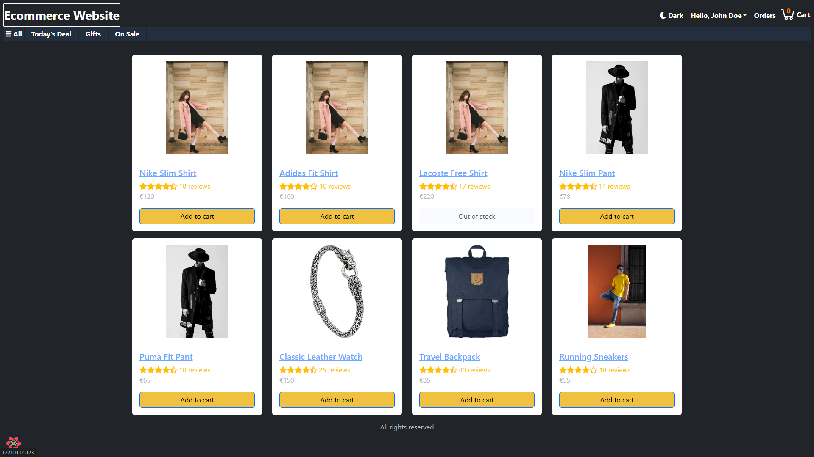
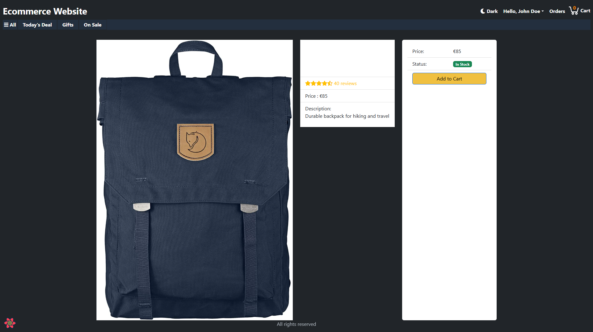

# 🛍️ Modern E-Commerce Platform


> A full-stack, feature-rich e-commerce application built with the MERN stack and TypeScript. Designed with modern architecture, secure authentication, and a responsive UI.

## 🚀 Live Demo

**[View Live Application](https://ecommerce-website-nodejs-hx14.onrender.com)**

---

## 📸 Screenshots

|                                                  Home Page                                                   |                                                    Product Details                                                    |
| :----------------------------------------------------------------------------------------------------------: | :-------------------------------------------------------------------------------------------------------------------: |
|  |  |

---

## ✨ Key Features

- **User Authentication:** Secure login and registration using JWT and Bcrypt.
- **Product Management:** Browse, search, and filter products with pagination.
- **Shopping Cart:** Real-time cart management (add, remove, adjust quantities).
- **Checkout Process:** Multi-step checkout with shipping address and payment method selection.
- **Payment Integration:** PayPal integration for secure transactions.
- **Admin Dashboard:** Manage products, orders, and users.
- **Responsive Design:** Optimized for mobile, tablet, and desktop using Tailwind CSS.

---

## 🛠️ Tech Stack

### Frontend

- **Core:** [React](https://reactjs.org/) (v18), [TypeScript](https://www.typescriptlang.org/)
- **Build Tool:** [Vite](https://vitejs.dev/)
- **State Management:** [Redux Toolkit](https://redux-toolkit.js.org/), [TanStack Query](https://tanstack.com/query/latest)
- **Styling:** [Tailwind CSS](https://tailwindcss.com/), [Bootstrap](https://getbootstrap.com/)

### Backend

- **Runtime:** [Node.js](https://nodejs.org/)
- **Framework:** [Express.js](https://expressjs.com/)
- **Database:** [MongoDB](https://www.mongodb.com/) (with Mongoose & Typegoose)
- **Security:** Helmet, Bcrypt, JWT
- **Language:** TypeScript

---

## ⚙️ Installation & Setup

Follow these steps to set up the project locally.

### Prerequisites

- Node.js (v16 or higher)
- MongoDB installed locally or a MongoDB Atlas URI

```bash
# Clone the repository
git clone [https://github.com/mirzazohaib/ecommerce-website-nodejs.git](https://github.com/mirzazohaib/ecommerce-website-nodejs.git)

# Install Backend
cd ecommerce-website-nodejs/ecommerce-backend-nodejs
npm install

# Install Frontend
cd ../ecommerce-frontend-nodejs
npm install
```

## 3. Running the App

You need two terminals open.

**Terminal 1 (Backend):**

```bash
cd ecommerce-backend-nodejs
# Ensure you have a .env file with MONGODB_URI defined
npm run dev
```

**Terminal 2 (Frontend):**

```bash
cd ecommerce-frontend-nodejs
npm run dev
```

Visit [http://localhost:5173](http://localhost:5173) to view the app.

## 🔑 User Guide

To fully test the application, you can use the pre-configured accounts or create your own.

### 🛑 Important: Seeding Data

If the product catalogue is empty, you can reset the database to the default sample data (Products + Users) by visiting:
[http://localhost:4000/api/seed](http://localhost:4000/api/seed)

_(Note: This deletes all current data and restores defaults)_

### 👤 Default Accounts

| Role  | Email             | Password |
| ----- | ----------------- | -------- |
| Admin | admin@example.com | 123456   |
| User  | user@example.com  | 123456   |

### 🆕 Creating a New User

1. Click **Sign In** in the top navigation.
2. Click the **"Create your account"** link at the bottom of the form.
3. Fill in your details. You will be automatically logged in after registration.

### 🛠️ Features

- **Authentication**: JWT-based auth with Register/Login functionality.
- **Product Catalogue**: Search, filter by category, and view product details.
- **Shopping Cart**: Persistent cart state.
- **Checkout Flow**: Shipping → Payment → Place Order.
- **Admin Dashboard**: (Accessible via Admin account) Manage products and orders.

### 🤝 Contributing (GitHub Flow)

1. Create a branch: `git checkout -b feature/your-feature-name`
2. Commit changes: `git commit -m 'Add some feature'`
3. Push to branch: `git push origin feature/your-feature-name`
4. Open a Pull Request.

---

### Step 5: "Merge" The Changes

Since you are the sole developer here, "merging" implies testing it and then committing to main.

1. **Test:**

   - Restart your backend (`npm run dev`).
   - **Crucial:** Go to your browser and visit `http://localhost:4000/api/seed`. You should see a JSON response confirming 8 products and 2 users were created.
   - Go to the Frontend (`http://localhost:5173`).
   - Click **"Gifts"** → It should show the Backpack and Watch.
   - Click **"Sign In"** → Use `admin@example.com` / `123456`.

2. **Commit:**
   ```bash
   git add .
   git commit -m "feat: expand catalogue, fix nav links, update readme"
   git checkout main
   git merge feature/catalogue-and-docs
   ```
